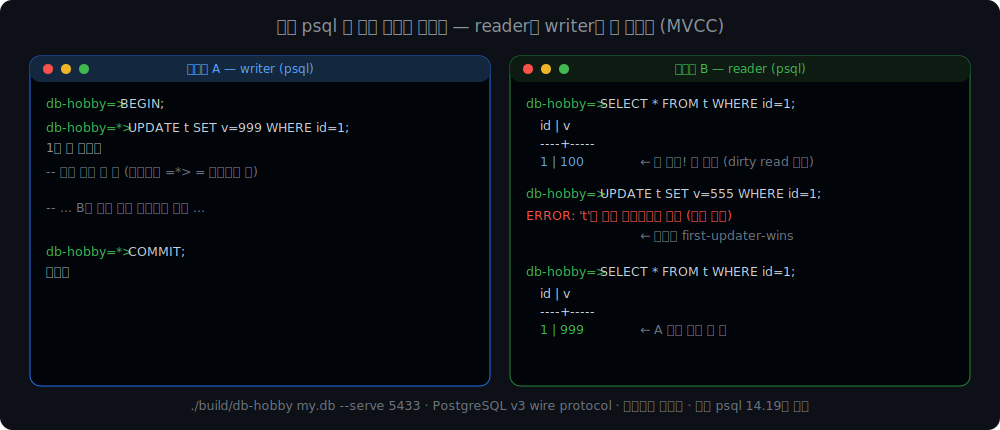
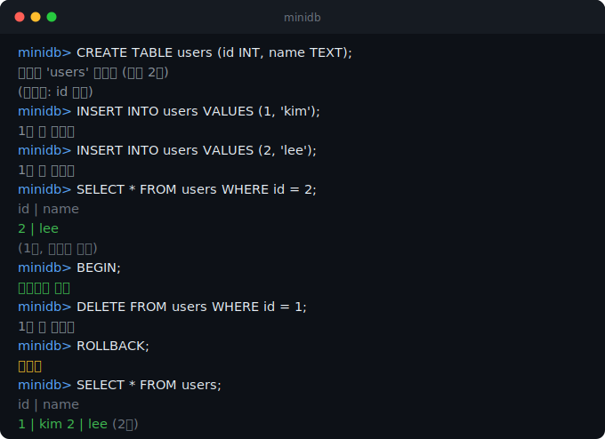

# db-hobby

A small relational database written from scratch in C — one that **an actual
`psql` connects to**, with **MVCC snapshot isolation where readers don't block
writers**, WAL crash recovery, VACUUM, a thread-safe buffer pool, and a
cost-based query planner. And past the single node into the hard parts:
**primary→replica replication over a real socket, Raft consensus** (leader
election, log replication, disk-persisted votes, snapshots, membership changes)
that **replicates the real engine into a highly-available DB surviving leader
death**, and an **LSM storage engine**. Built from raw fixed-size pages up to running
SQL — and out to a small distributed system — to dissect how PostgreSQL and
MySQL actually work inside.



Two real `psql` clients above, interleaving over the PostgreSQL wire protocol:
while A holds an uncommitted `UPDATE`, B reads the **old** version (not blocked),
a second writer is rejected (first-updater-wins), and after A commits B sees the
new value. That's MVCC — and it's a 400-line server speaking Postgres's protocol,
so psql can't tell the difference.

It's a learning project: the goal isn't to invent something new, it's to
reproduce the real structure accurately and understand it. Every layer is
covered by tests (**645 checks across 37 suites**), and the concurrency is
verified under ThreadSanitizer. The 36-part build log is at
[IT-Oasis / db-hobby](https://dj258255.github.io/IT-Oasis/blog/project/db-hobby/db-hobby-0-overview).

**What's in it:** page storage · buffer pool (thread-safe, pin protocol) · heap ·
B+Tree (+ concurrent latch-crabbing variant) · hand-written SQL parser & executor ·
joins (nested-loop / index / hash) · aggregates · WAL with **steal + no-force**
recovery · **MVCC** (xmin/xmax, snapshot isolation, VACUUM) · multi-transaction
sessions · a **PostgreSQL-wire server** · a **cost-based optimizer** (ANALYZE,
selectivity, Selinger join-order DP) · **log-shipping + TCP replication** ·
**Raft consensus** (election, log replication, persistence, snapshots) · an
**LSM storage engine**. Heap (PG) vs clustered (InnoDB) storage is benchmarked
side by side.



## Quick start

```sh
make test            # build and run the test suite
make bench           # build (-O2) and run the benchmark (index vs scan, fsync cost)
make repl            # build the REPL
./build/db-hobby my.db # open (or create) a database and type SQL

# or speak the real PostgreSQL wire protocol and connect with psql:
./build/db-hobby my.db --serve 5433
psql "host=127.0.0.1 port=5433 dbname=db-hobby"
```

The `--serve` mode is a **thread-per-connection** server that speaks PostgreSQL's
v3 wire protocol, so **an actual `psql` connects to it** (tested against psql
14.19). Each connection gets its own OS thread and one of the multi-transaction
sessions, so two `psql` windows demonstrate "readers don't block writers" over
the network. The buffer pool is thread-safe (a per-pool latch; the pin protocol
protects the returned page data), verified by a pthreads stress test that runs
clean under ThreadSanitizer. Execution itself is still serialized by one coarse
engine latch -- finer-grained latching (B+Tree latch crabbing, a blocking lock
manager, dropping the engine latch) is the remaining frontier. (Simple query
only -- no extended/prepared protocol; SELECT rows are parsed from the executor's
text output, so a `TEXT` value containing `" | "` splits columns.)

A session:

```
db-hobby> CREATE TABLE users (id INT, name TEXT);
테이블 'users' 생성됨 (컬럼 2개)
  (인덱스: id 컬럼)
db-hobby> INSERT INTO users VALUES (1, 'kim');
db-hobby> INSERT INTO users VALUES (2, 'lee');
db-hobby> SELECT * FROM users WHERE id = 2;
id | name
2 | lee
(1행, 인덱스 사용)
db-hobby> BEGIN;
db-hobby> DELETE FROM users WHERE id = 1;
db-hobby> ROLLBACK;
db-hobby> SELECT * FROM users;
id | name
1 | kim
2 | lee
(2행)
```

Each table is stored as its own pair of files and survives a restart (the schema
is persisted too, so no need to re-run `CREATE TABLE`) -- see the storage layout
below.

## What's inside

Built bottom-up; each layer sits on the one below it.

| Layer | What it does | Mirrors |
|---|---|---|
| `pager.c` | fixed-size 4KB pages <-> a single file (`page_id * PAGE_SIZE`) | SQLite pager, PG smgr |
| `page.c` | slotted page: pack variable-length rows into a page | PG/InnoDB page layout |
| `bufpool.c` | page cache with pin counts, dirty flags, LRU eviction | InnoDB buffer pool |
| `heap.c` | table = a collection of pages; rows addressed by `RID = (page, slot)` | PG heap |
| `sql.c` | hand-written lexer + recursive-descent parser (SQL -> AST) | every DB frontend |
| `db.c` | executor: tuple codec, multi-table catalog, joins (NLJ/index/hash), aggregates | pg_catalog, executor |
| `btree.c` | on-disk B+Tree index for O(log n) lookups, with node splits | InnoDB clustered index |
| `wal.c` | write-ahead log on each table's data file: atomic commit + crash recovery | PG WAL / redo log |
| `mvcc.c` | transaction-state log + visibility rule (xmin committed AND xmax not) | PG MVCC / tqual |
| `lock.c` | 2PL table locks (S/X) + deadlock detection (wait-for graph) for isolation | PG/InnoDB lock manager |

### Storage layout

Like PostgreSQL (each relation is its own file, `relfilenode`), every table lives
in its own files, and a catalog file lists which tables exist:

```
mydb              catalog -- table names + schemas (like pg_class)
mydb.users.tbl    users rows  (heap)
mydb.users.wal    write-ahead log for the heap (commit atomicity + crash recovery)
mydb.users.idx    users PK index (B+Tree)
mydb.users.idx.wal  write-ahead log for the index
mydb.orders.tbl   orders rows
mydb.orders.wal
mydb.orders.idx   orders PK index
mydb.orders.idx.wal
```

## Beyond the single-node engine

The core above is one coherent single-node database. On top of it, the harder
axes of a real system are built as **focused, independently-tested modules** —
each with an honest boundary spelled out in its part of the build log. Most are
kept as standalone modules (so the 600+ green tests stay safe), each marking
where it ends and integration would begin — **except three capstones wired
end-to-end**: WAL replication (a replica replays the *real engine's* committed
WAL and serves `SELECT`), Raft state-machine replication (`raftdb.c`), and the
**LSM tree as a pluggable PK index** (`CREATE TABLE … USING lsm`).

| Module | What it does | Mirrors |
|---|---|---|
| `raft.c` | **Raft consensus** — leader election, log replication, the five §5 safety properties, disk-persisted term/vote (prevents double-voting across a crash), log compaction + InstallSnapshot (§7), and single-server membership changes (§6). Verified on a *deterministic simulated network* that injects partitions, crashes, and reordering | etcd / Consul Raft |
| `raftdb.c` | **Raft-replicated HA database** — state-machine replication wiring `raft.c` onto the real `db.c` engine: a write is proposed to Raft, and every node applies the committed command to its own engine. Survives leader death (failover); engines stay consistent; linearizable reads via ReadIndex (a partitioned old leader is refused, not served stale) | etcd / TiKV, replicated SQL |
| `replica.c` + `replnet.c` | **WAL replication** — a replica tails the primary's WAL and replays committed records (the crash-recovery redo, run as a stream); carried over a real socket via a walsender/walreceiver. **Wired end-to-end**: replicates the real engine's writes into a replica that serves `SELECT` (base snapshot + WAL replay, pg_basebackup-style) | PostgreSQL streaming replication |
| `lsm.c` | an **LSM-tree** storage engine — memtable → SSTable flush → compaction, tombstone deletes — the write-optimized counterpart to the B+Tree. **Wired into the engine** as a pluggable PK index (`CREATE TABLE … USING lsm`): a multi-value mode holds the non-unique PK→RID multimap that MVCC needs, routed through a small Table Access Method (`pidx_*`) | RocksDB / MyRocks |
| `joinopt.c` | a **Selinger join-order optimizer** — subset DP (2ⁿ instead of n!), cross-product avoidance, cardinality estimation | System R planner |
| `cbtree.c` | a **concurrent B+Tree** with latch crabbing (per-node rwlocks), ThreadSanitizer-clean | InnoDB index concurrency |
| `parscan.c` | a **parallel sequential scan** — worker threads sweep disjoint page ranges over the thread-safe buffer pool, leader merges in page order; identical to serial down to RID order, ThreadSanitizer-clean. The first foothold to peel the coarse engine latch off layer by layer | PostgreSQL parallel query |

## SQL supported

```
CREATE TABLE <t> (<col> INT|TEXT [NOT NULL], ...)
CREATE INDEX <name> ON <t> (<col>)   -- secondary index on an INT column
INSERT INTO <t> VALUES (<int|'text'>, ...)
SELECT [DISTINCT] <* | item, ...>
       FROM <t> [<alias>] [[LEFT] JOIN <t2> [<alias>] ON <colref> = <colref>]...
                  [WHERE <cond> [AND <cond>] [OR ...]]
                  [GROUP BY <col>] [HAVING <item> <op> <value>]
                  [ORDER BY <colref | position> [ASC|DESC], ...] [LIMIT <n>] [OFFSET <n>]
UPDATE <t> SET <col> = <value> [WHERE ...]
DELETE FROM <t> [WHERE ...]
BEGIN | COMMIT | ROLLBACK
EXPLAIN <select>          -- print the query plan instead of running it

<item>   is  <col> | COUNT(*) | COUNT|SUM|MIN|MAX|AVG(<col>)
<cond>   is  <colref> <op> <value>  |  <colref> <op> (SELECT <col> FROM <t> [WHERE ...])
                                   |  <colref> IS [NOT] NULL
                                   |  <colref> [NOT] IN (<value>, ...)
                                   |  <colref> [NOT] IN (SELECT <col> FROM <t> [WHERE ...])
                                   |  <colref> [NOT] BETWEEN <value> AND <value>
                                   |  <colref> [NOT] LIKE '<pattern>'   (% = any run, _ = one char)
<op>     is one of  =  !=  <  >  <=  >=
<colref> is  [<table>.]<col>
```

An `=`, `<`, `>`, `<=`, or `>=` on the first column (an `INT` primary key) uses
the B+Tree index -- `=` is an O(log n) point lookup, the others walk the linked
leaf chain as a range scan. A `CREATE INDEX` on a non-PK `INT` column adds a
secondary (non-unique) B+Tree; an `=` filter on that column does an index scan
(`btree_find_all` collects candidate RIDs, then each is heap-fetched and the
`WHERE` is rechecked to drop deleted/stale rows), and `EXPLAIN` shows `Index Scan
using <name>`. `!=`, other conditions, and compound `AND` conditions fall back to
a full scan -- the kind of choice a query planner makes. `ORDER BY`/`LIMIT` and `GROUP BY`/aggregates take a materialize path
(collect, then sort / sort-group); grouped results can be filtered with `HAVING`
and ordered by an output column or position (so `ORDER BY 2 DESC` gives top-N by
an aggregate). `JOIN` is a recursive N-way join that picks a
method per level like an optimizer: index nested-loop (`btree_search`) when the
inner's primary key is the `ON` key, hash join (build a hash on the inner's join
column, then O(1) probe) for any other equi-join, else a plain nested-loop scan.
`LEFT JOIN` preserves unmatched left rows by filling the right side with `NULL`.
`NULL` can also be stored: `INSERT ... VALUES (1, NULL)` keeps it via a null bitmap
at the front of each row (the first/PK column stays `NOT NULL`). Either way `COUNT(*)`
counts those rows but `COUNT(col)`/`SUM`/`AVG` skip the `NULL`s, and `IS [NOT] NULL` tests
for them (`LEFT JOIN ... WHERE right.col IS NULL` is the anti-join). `SELECT
DISTINCT` dedupes output rows. `IN (1, 2, 3)` tests membership against a literal
value set; `IN (SELECT ...)` runs an uncorrelated subquery once into a value set,
then tests membership the same way. `BETWEEN a AND b` is desugared at
parse time into `>= a AND <= b` (inclusive); `LIKE`/`NOT LIKE` match `%` (any run)
and `_` (one char) with a backtracking matcher -- both run as a full scan, not via
the index. Writes go through a **write-ahead
log**: a commit (explicit or per-statement autocommit) stages the transaction's
dirty pages -- for both the heap and the B+Tree index -- and logs them with a
commit marker + `fsync`. That log `fsync` is the **only durability point
(no-force)**: pages are then written back to the data file without `fsync`, and
the log is *not* truncated -- it accumulates committed history as the source of
truth, trimmed by a size-threshold checkpoint (and on every reopen). If a
transaction's dirty pages outgrow the buffer pool, they are **stolen** (evicted to
disk before commit) only after their *before-image* is logged first, so the change
stays undoable. Crash recovery on reopen walks the log: **redo** each committed
segment's after-images in commit order, then **undo** the uncommitted tail's
before-images and truncate any pages it allocated. Rollback undoes the same way.

See `DESIGN.md` for the full layer map and build order.

## Scope (honest limitations)

Kept simple on purpose: the first column of each table is treated as a unique
integer primary key; `WHERE` is in disjunctive normal form (AND-groups joined by
OR, no parentheses); joins are INNER only, each `ON` is a single `=`, chained up
to 4 tables (`INNER` and `LEFT`, aliases supported, so self-joins work);
projection, aggregation, `GROUP BY`, and `HAVING` work over a single table or a
join result; `NULL` can be stored (nullable columns) or arise from `LEFT JOIN`, except the PK column; subqueries are
uncorrelated and single-table/single-column; execution is single-threaded, but
**multiple transactions interleave** through sessions (`SESSION n` switches the
current one, up to 8): **readers take no locks** -- a reader is never blocked by
a writer, it simply sees the old version through MVCC visibility, and an open
transaction reads from its **begin-time snapshot** (repeatable-read-style; plain
statements outside a transaction are read-committed). Writers take table-level
`X` locks (strict 2PL, held to commit), so a second writer on the same table is
rejected immediately -- **first-updater-wins at table granularity**. That same
X lock guarantees one writer per table, which is exactly why the per-table WAL
recovery (steal/undo/no-force) still holds unchanged. The PK index is
**multi-version** (one entry per row version, like PostgreSQL); lookups pick the
visible version. Closing the database rolls back any open transactions, like a
real server dropping connections. The WAL
protects both the data (`.tbl`) and index
(`.idx`) files; a transaction larger than the buffer pool is handled by stealing
dirty pages to disk with undo (before-image) logging, and commit is **no-force**
(one log `fsync`; the log is the source of truth, trimmed by a simple size-threshold
checkpoint). Logging is whole-page physical -- redo *and* undo are idempotent, so
pageLSN and CLRs are unnecessary here (a crash-injection test proves recovery
converges even when re-crashed mid-undo); fuzzy checkpoints and 3-pass ARIES
await the preconditions that actually demand them (concurrency, physiological
logging). `DELETE` is MVCC-style: rows are never physically removed -- `DELETE`
(and `UPDATE`'s old version) just stamps `xmax`, and **every** read path (full
scan, PK point/range lookup, secondary index, joins, aggregates, subqueries)
filters by visibility; dead versions accumulate until **`VACUUM [table]`**
reclaims them: it deletes their index entries (lazy B+Tree leaf deletion,
PostgreSQL-nbtree-style -- no merge/redistribute), empties their heap slots,
compacts each page (RIDs stay stable), and truncates trailing all-empty pages
(PG-style conditional truncation). VACUUM refuses to run inside a transaction
(as in PostgreSQL), and its heap/index cleanup commits atomically through the
WAL. These are noted in the code where they matter.

## License

MIT
